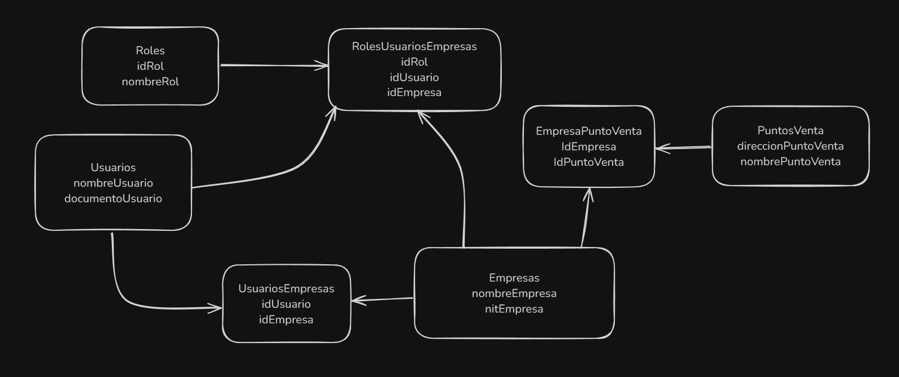
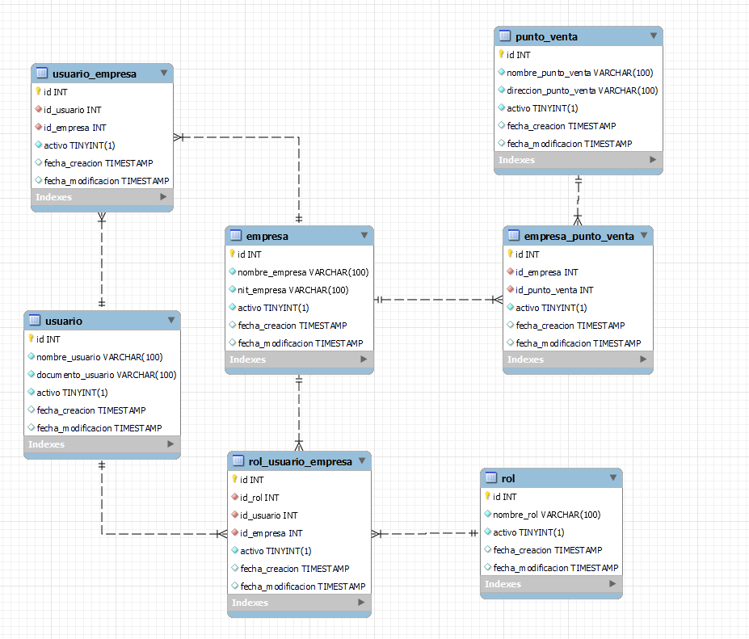
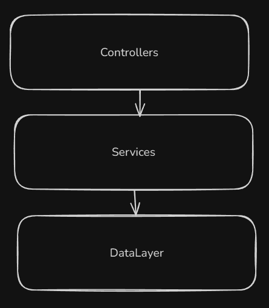

# prueba-sivar

Se requiere crear una relación entre tablas, donde requiero tener usuarios (con información basica del usuario), y que cada usuario pueda tener una o multiples Empresas (información basica de empresa, nombre, nit) y para cada empresa el usuario va a tener un rol especifico. Por cada empresa tener puntos de venta(informacion de direccion, y nombre).
Considerar que cada empresa puede tener asociado varios usuarios y cada Punto de venta puede estar asociado a varias empresas y no se deben repetir las empresas ni los puntos de venta en las tablas.

# Instalación

- npm install
- Modificar los datos en el archivo de configuracion env.js, con los datos de la base de datos.
- Crear el schema con el nombre que se definio en el archivo de configuracion.
- npm start (para correr el servidor)

# Definicion de tablas

- **Usuario**: Tabla que contiene la información básica de los usuarios.
- **Empresa**: Tabla que contiene la información básica de las empresas.
- **UsuariosEmpresas**: Tabla que contiene la relación entre los usuarios y las empresas.
- **Roles**: Tabla que contiene los roles que puede tener un usuario en una empresa.
- **RolesUsuariosEmpresas**: Tabla que contiene la relación entre los usuarios, las empresas y los roles, para el manejo de la authorities.
  - Se decidio crear esta tabla por aparte para no acoplar la tabla de usuariosEmpresas con los roles.
- **PuntoVenta**: Tabla que contiene la información de los puntos de venta.
- **EmpresasPuntosVenta**: Tabla que contiene la relación entre las empresas y los puntos de venta.

# Modelo relacional

# Arquitectura

Se opto por una arquitectura de 3 capas dada su simplicidad y rapides de implementacion, donde se tiene una capa de presentación, una capa de negocio y una capa de datos. 

# Detalles de implementación
- No se uso un ORM como sequelize, se opto por usar el modulo mysql2 para la conexión a la base de datos, mas que nada por temas de tiempo.
- Falto contenerizar la aplicacion.

# Tecnologias usadas
- Node.js
- Express
- MySQL